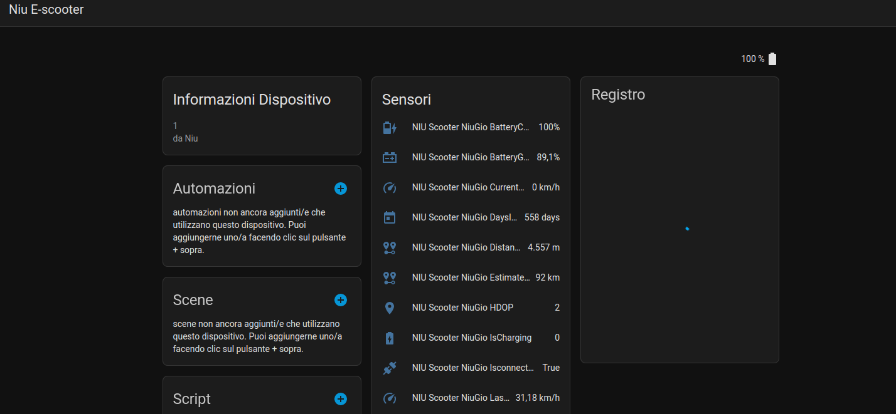
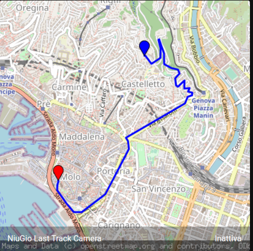
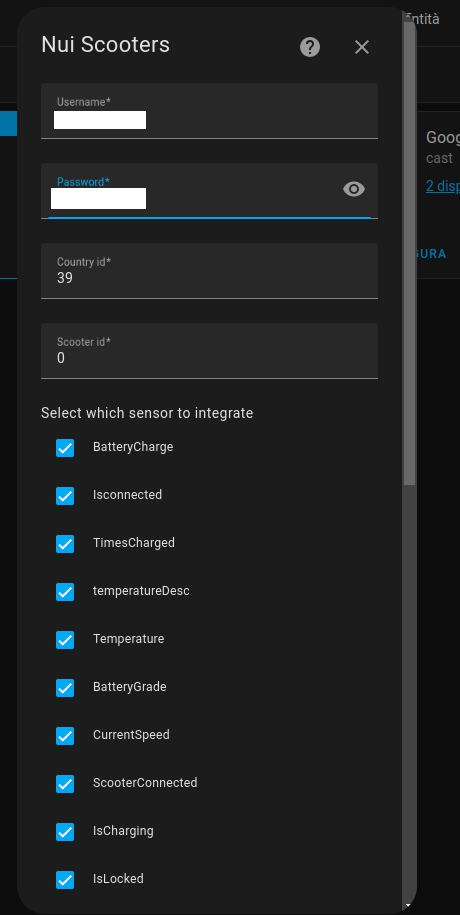

# Niu E-scooter Home Assistant integration

This is a custom component for Home Assistant to integrate your Niu Scooter.

Forked by https://github.com/marcelwestrahome/home-assistant-niu-component

Now this integration is _asynchronous_ and it is easy installable via config flow.

## Changes:
* Now it will generate automatically a Niu device so all the sensors and the camera will grouped

* If you select the Last track sensor automatically it will create a camera integration, with the rendered image of your last track.

## Install

You can install this custom component by adding this repository ([https://github.com/pikka97/home-assistant-niu-component](https://github.com/pikka97/home-assistant-niu-component)) to [HACS](https://hacs.xyz/) in the settings menu of HACS first. You will find the custom component in the integration menu afterwards, look for 'Niu Scooter Integration'. Alternatively, you can install it manually by copying the `custom_components` folder to your Home Assistant configuration folder.

## Setup
1. In Home Assistant's settings under "device and services" click on the "Add integration" button.
2. Search for "Niu Scooters" and click on it.
3. Insert your Niu app companion's credentials and select which sensors do you want.

4. Enjoy your new Niu integration :-)

## Known bugs
See https://github.com/marcelwestrahome/home-assistant-niu-component repository
