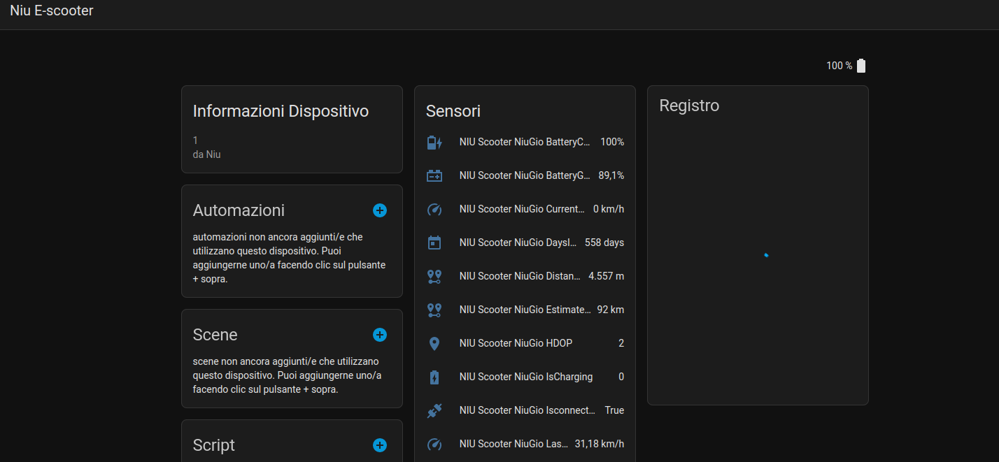
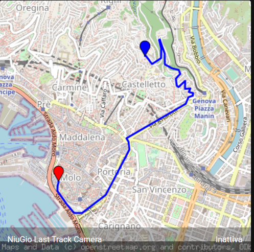

# NIU Home Assistant integration

This custom component integrates compatible NIU vehicles with Home Assistant.

Now this integration is _asynchronous_ and it is easy installable via config flow.

## Changes:
* It automatically creates a NIU device so its sensors and camera are grouped together.

* If you select the Last track sensor automatically it will create a camera integration, with the rendered image of your last track.

With the thanks to pikka97 !!!

## Setup
1. In Home Assistant's settings under "device and services" click on the "Add integration" button.
2. Search for "NIU" and click on it.
3. Enter the NIU account email and password.
4. Select a vehicle by name and serial number, then select the sensors you want to add.
5. To add another vehicle, add the NIU integration again and repeat these steps. The same NIU account credentials can be used for multiple vehicles.
6. Enjoy your new NIU integration :-)

## Known bugs

some people had problems with this version please take the latest 1.o  versions
See https://github.com/marcelwestrahome/home-assistant-niu-component repository
